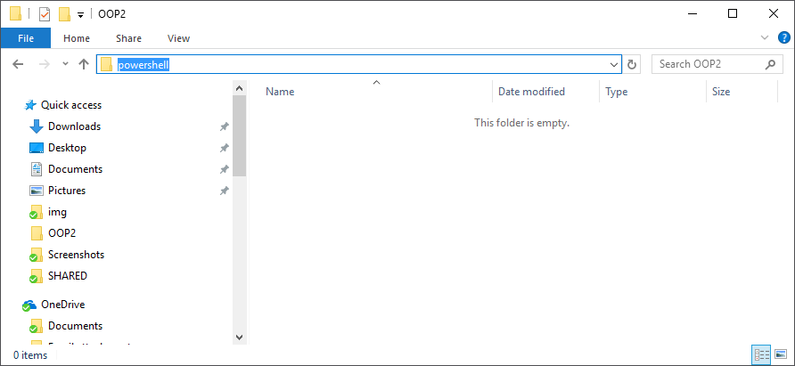
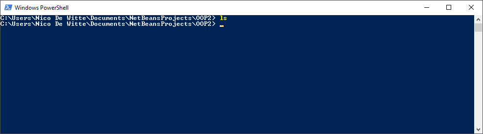
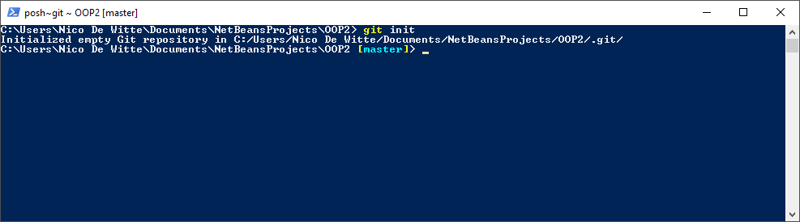
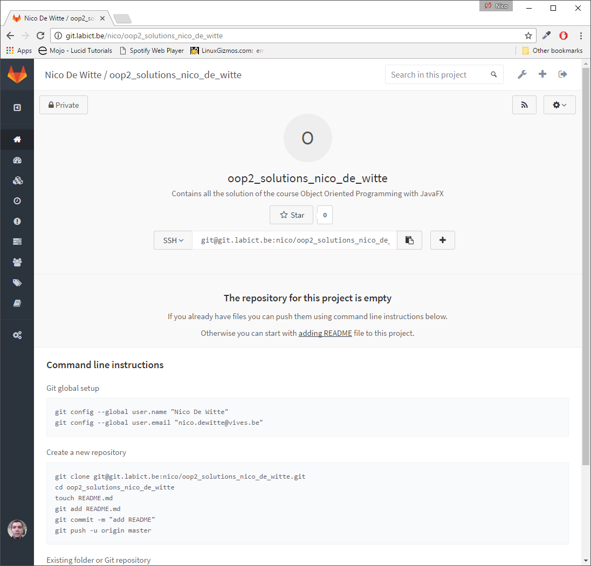
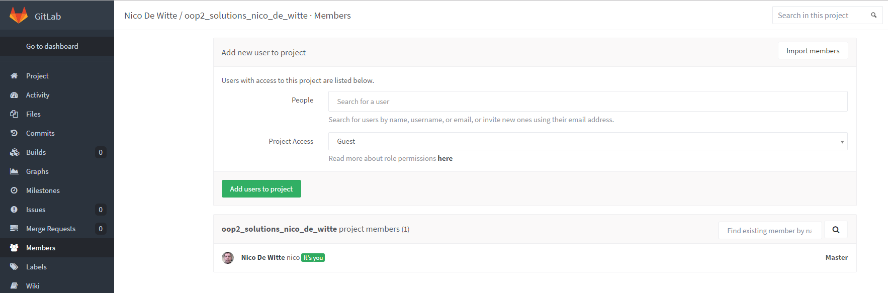
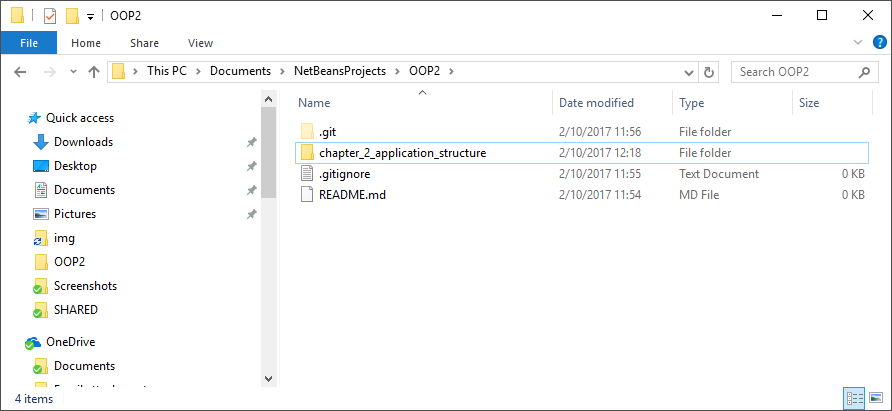
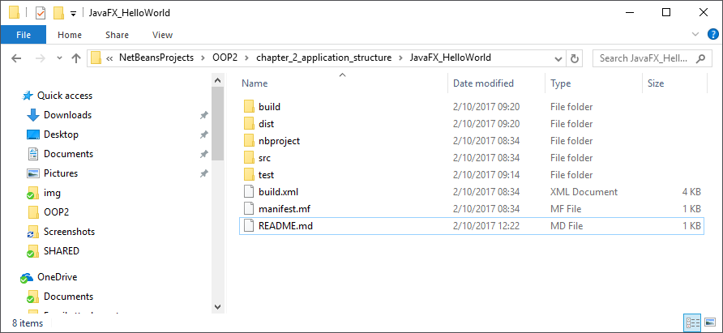
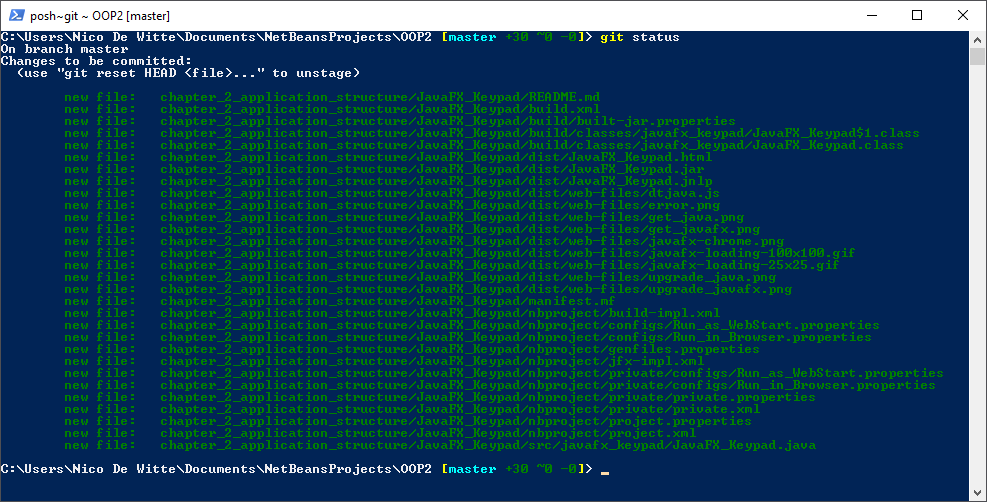
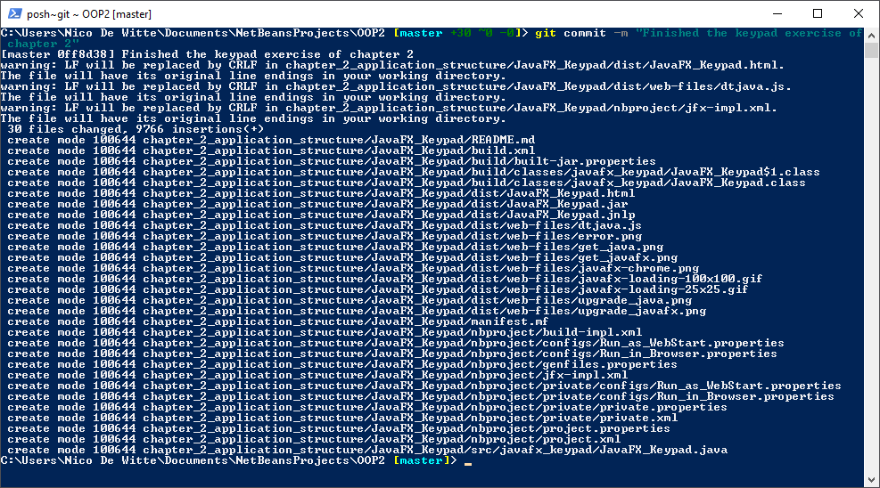

# Using Git for Exercises

Instead of Toledo we will be using Git to upload your exercise solutions. For any questions on Git please refer to the GitBook https://www.gitbook.com/book/sillevl/git/details

## The Idea

The idea is to use a single repository to track all your exercises in this course.
This allows me as a teacher, to clone the your repository and view your solutions to the exercises all at once. After each lab session you can push the solutions for exercises allowing me to pull them.

For this we will be using the Gitlab service on the *labict* server. You should have received an account from that allows you to login at http://git.labict.be.


## Setup

### Creating a Project Directory

The first step to take is to create a project directory where we will store all the solutions to the exercises. You can choose the location and name for this directory for you convenience.

### Creating a local Repository

The next step is to create a local git repository of the main project directory. Do take note that this only has to be done once.

Navigate to your main project directory using Windows Explorer. For example: `C:\Users\<your_name>\Databases\Exercises`.

Now in the top of your window, where the path is shown, type `powershell` and hit *Enter*. This launch PowerShell and set the working directory to the current directory.



If you type `ls` (which stands for list), you should see an empty directory.



Now we need to create a git repository in the current directory. For this the following command (without the `$` sign, this represents the terminal) needs to be executed inside Powershell.

```shell
$ git init
```



You can see the changes of the current state of the repository by executing

```shell
$ git status
```


#### README.md

Before continuing we should add a readme file to the repository. This allows you to publish some basic information and documentation about the exercises. It is also really handy as it is the page that is shown on Github when you visit a repository page of someone.

Start by creating a file in the top directory of your repository called `README.md`. Make sure to put the filename in capitals and also make sure that the extension is correct.

Now you can edit the file using a text editor such as Atom (preferred as it will have syntax highlighting for Markdown).

Start from the following content:

```markdown
# Exercises Databases

This repository belongs to [student_name].

## Instructions

* Make sure to fill in your name in the section at the top of this readme.
* All exercises of a single chapter should be bundled in a directory with the same name as the chapter.
* Each exercise should be in a separate directory beneath the chapter directory. The name of the exercise should be clear and match the name of the exercise in the GitBook course.
* Each solution should be accompanied by a README.md file containing at least following parts:
  * The state of the current solution: is it working, is it not working (then why?), ...
  * Make sure to document the creative parts that you added.
  * Extras can be: was it too hard or too easy
```

### Adding and Commiting

We have come to a point where we should commit the changes we have made to our repository.

If we do a `git status` command we see what files were added, changed or removed.


Let's first commit the README. This can be done by first adding it and than commit it with a decent message:

```shell
$ git add README.md
$ git commit -m "Add a readme file to the repository as information source for solutions"
```

### Creating a Remote Repository

The next step consist of creating a remote repository on the [gitlab server](https://git.labict.be).

Goto http://git.labict.be, login using your account and create a new repository by selecting the **New Project** option at the front page. Give the repository a name following this format: `databases`. Make sure to make repository private.

It is also a good idea to provide a description to the repository. For example: 'Contains all the solution of the course Databases'.


Finally hit *Create repository*. You should be taken to a page similar to the one shown below.



Last we need to link our local repository to this remote repository. This allows us to *push* the changes from the local to the remote repository.

Copy the whole `git remote add` command on the github page beneath the 'Existing folder or Git repository' section on your project page.

Go back to your Powershell window and *right click* inside the window. This will paste the copied command. *Hit enter* to execute it.


If no errors are displayed, all should have gone well. Now you local repo is connected to your remote repo.

### Pushing

Currently, the remote repo has not yet received the changes yet that we added to the local repo. To fix this, we need to push the changes from the local repository up to the remote repository.

This can be achieved using the following command:

```shell
git push -u origin master
```

You only need to specify the `-u origin master` the first time. Next time you can use `git push` and it will automatically assume that you want to push the *master* to *origin*.


If you go back to the Gitlab service and refresh the page you should see the rendered version of the README markdown file as shown below.


### Adding teachers as project members

When on the main page of your project at the Gitlab service, select the `Members` page on the left.



Next type in the name of your teacher and add him/her as a **master** member to the project. Finish by clicking `Add users to project`.


### Creating Subdirectories for Chapters

You should create a subdirectory for each chapter before adding projects to it. Go ahead and create a subdirectory `oef-1` beneath the main project directory.



### README.md per project aka Report

Instead of a Word report it is necessary to add a small README.md file per project containing minimalistic information for the teacher. Create this README.md file inside the actual project directory as shown below.



An example of a README.md file for the *Second Button* exercise is shown below.

```markdown
# Second Button

Ik heb deze oefening werkende gekregen maar ik had graag de knop links bovenaan gekregen maar dit werkte niet. Hiervoor heb ik gebruik gemaakt van de setAlignment() methode van de class Scene. Deze genereerde echter de foutmelding `Could not find method setAlignment() for class Scene`.

Als extra heb ik de kleur van de achtergrond ingesteld en verandert de knop ook telkens van kleur wanneer je er op klikt.
```

### What to do next

After you finished a project and you added a readme file to it, it's time to commit it and push it to the remote.

Open up the main exercises directory using Windows Explorer, for example `C:\Users\<your_name>\Documents\Databases`.


When you execute `git status` you will see what files have changed.


First we need to add the files to the staging area:

```shell
$ git add oef-1/
```

When you execute `git status` you will see what files have been added for the next commit.



Now we need to commit our changes and add a decent commit message.

```shell
$ git commit -m "Finished exercise 1"
```



Last but not least we should push the changes to the remote.

```shell
$ git push
```

If we check the gitlab service we should see that the changes have been pushed to the remote.


