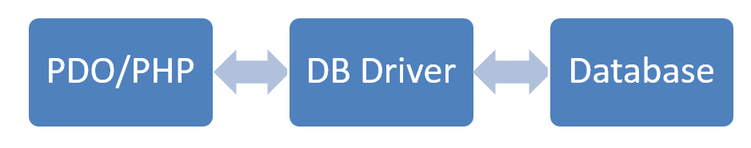

# PHP PDO

## PHP database extensions
There are several ways to interface with MySQL (or other database management systems). PHP provides 3 extensions.

### MySQL – MySQL extension
* Included in PHP 3.x, 4.x, 5.x
* Does not take advantage of the new features of MySQL 4.1.3 and later
* Not under active development
* Removed in PHP 7.0

### MySQLi – MySQL extension improved
* Object oriented AND procedural
* Takes full advantage of all the features of MySQL 4.1.3 and later
* MySQL Only!
* Removed in PHP 7.0

### PDO – PHP Data Object

* Since PHP 5.1
* Consistent object-oriented interface
* Multiple database support (12): MySQL, MsSql, Sqlite, Oracle, IBM, Posgresql,…
* Portable
* Doesn’t take full advantage of all the features of MySQL 4.1.3 and later

PHP Data Objects provide an database abstraction layer. PDO is the **method of choice** when interfacing a database in PHP.

## PDO: PHP Data Object

PDO provides a database access layer enabling a uniform method of access to multiple databases. Changing database type does not change the PDO code. This enables switching database types without rewriting any code.



To get all available drivers you can use the `getAvailableDrivers()` function:
```php
print_r(PDO::getAvailableDrivers());
```
PHP Data Objects supports the following drivers:

| Driver name	 | Supported databases                        |
|:---------------|:-------------------------------------------|
| PDO_CUBRID     | Cubrid                                     |
| PDO_DBLIB      | FreeTDS / Microsoft SQL Server / Sybase    |
| PDO_FIREBIRD   | Firebird                                   |
| PDO_IBM        | IBM DB2                                    |                                         
| PDO_INFORMIX   | IBM Informix Dynamic Server                |
| PDO_MYSQL      | MySQL 3.x/4.x/5.x                          |
| PDO_OCI        | Oracle Call Interface                      |
| PDO_ODBC       | ODBC v3 (IBM DB2, unixODBC and win32 ODBC) |
| PDO_PGSQL      | PostgreSQL                                 |
| PDO_SQLITE     | SQLite 3 and SQLite 2                      |
| PDO_SQLSRV     | Microsoft SQL Server / SQL Azure           |
| PDO_4D         | 4D                                         |

### Connection strings

* Database handle
* Database type
* Connectionstring
    * Depending on the database type

```php
$DBH = new PDO("mysql:host=$host;dbname=$dbname", $user, $pass);
```

### Opening and closing connections

Opening

```php
try {
   # MS SQL Server and Sybase with PDO_DBLIB
   $DBH = new PDO("mssql:host=$host;dbname=$dbname, $usr, $pw");
   $DBH = new PDO("sybase:host=$host;dbname=$dbname, $usr, $pw");

   # MySQL with PDO_MYSQL
   $DBH = new PDO("mysql:host=$host;dbname=$dbname", $usr, $pw);

   # SQLite Database
   $DBH = new PDO("sqlite:my/database/path/database.db");
} catch(PDOException $e) {
    echo $e->getMessage();
}
```

Closing

```php
$DBH = null;
```

### Exceptions

* Handling errors
* Wrap every PDO interaction in a try/catch block

#### Error modes

* 3 error modes

1. PDO::ERRMODE_SILENT
    Default
    No action is taken
    Set errorcodes, available via   PDO::errorCode() and PDO::errorInfo()
2. PDO::ERRMODE_WARNING
    Raises E_WARNING
    Show warning
3. PDO::ERRMODE_EXCEPTION
    Errorcodes will be set
    Will throw an exception of the PDOException class


```php
$DBH->setAttribute( PDO::ATTR_ERRMODE, PDO::ERRMODE_SILENT );
$DBH->setAttribute( PDO::ATTR_ERRMODE, PDO::ERRMODE_WARNING );
$DBH->setAttribute( PDO::ATTR_ERRMODE, PDO::ERRMODE_EXCEPTION );
```

#### Error handling

* ErrorMode = PDO::ERRMODE_EXCEPTION
* Always use Try/Catch
* Gracefull error handling
    * Friendly message to the user
    * Exception details to an log file

```php
try {
   $DBH = new PDO("mysql:host=$host;dbname=$dbname", $user, $pass);
   $DBH->setAttribute( PDO::ATTR_ERRMODE, PDO::ERRMODE_EXCEPTION );
   # UH-OH! Typed DELECT instead of SELECT!
   $DBH->prepare('DELECT name FROM people');
} catch(PDOException $e) {
   echo "I'm sorry. I'm afraid I can't do that.";
   file_put_contents('PDOErrors.txt', $e->getMessage(), FILE_APPEND);
}
```

## Inserting and updating data

Inserting and updating data follows a **two-step process**:

* Prepare
* Execute

```php
# STH means "Statement Handle"
$STH = $DBH->prepare(
   "INSERT INTO folks ( first_name ) values ( 'Cathy' )"
);
$STH->execute();
```
An additional 'bind' step can be added by using prepared statements.


### Prepared statements
Prepared statements make use of **precompiled SQL statements**.
These statements can be **executed multiple times**.
Prepared statements have the benefit of automatically making data “safe” by
**protecting against SQL injection**. This is accomplished by making use of **placeholders**.

PHP Data Objects support two types of placeholders. Named and unnamed placeholders.

!!! note "Unsafe data"
    All data inserted by the user of an website (eg: filling in a form, search text,
    or anything other that is not hard-coded into PHP) is considered unsafe!

```php
# no placeholders - ripe for SQL Injection!
$STH = $DBH->("INSERT INTO folks (name, addr, city) values ($name, $addr, $city)");

# unnamed placeholders
$STH = $DBH->("INSERT INTO folks (name, addr, city) values (?, ?, ?)”;

# named placeholders
$STH = $DBH->("INSERT INTO folks (name, addr, city) value (:name, :addr, :city)");
```

#### Unnamed placeholders

Write queries just like before, but instead of inserting the "unsafe" data as parts
of the query string, place a question mark sign `?` as placeholder for the data.
The unsafe data is then passed to the `execute()` method as an array. The indexes of
the array must correspond with the place of the question mark.
The array MUST be indexed in the right order.

Statements can be reused by passing in other arrays with different data with
the `execute()` method.

```php
# the data we want to insert
$data = array('Cathy', '9 Dark and Twisty Road', 'Cardiff');
$STH = $DBH->("INSERT INTO folks (name, addr, city) values (?, ?, ?);
$STH->execute($data);
```

#### Named placeholders

Instead of using question marks as placeholder, a named placeholder is used.
A placeholder starts with an colon sign: `:` followed by an name. When passing
the data array to the `execute()` method, an associative array must be used.
The associative indexes of the array must then correspond with the names of the
placeholders.
The advantage is that the array indexes can be out of order.

```php
# the data we want to insert
$data = array(
   'name' => 'Cathy', 'addr' => '9 Dark and Twisty', 'city' => 'Cardiff'
);

# the shortcut!
$STH = $DBH->("INSERT INTO folks (name, addr, city)
   value (:name, :addr, :city)");
$STH->execute($data);
```

## Selecting data

PHP Data Objects enable to select and retrieve results in different ways.
Results can be fetched as:

* Associative array
* Objects of type stdClass
* Objects of a predefined class
* ...

The fetch mode can be set with the `setFetchMode()` function:

```php
// Fetch results as an associative array
$STH->setFetchMode(PDO::FETCH_ASSOC);

// Fetch results as objects of type stdClass
$STH->setFetchMode(PDO::FETCH_OBJ);

// Fetch results as objects of type MyClass
$STH->setFetchMode(PDO::FETCH_CLASS, 'MyClass');
```

!!! note "stdClass"
    stdClass is PHP's generic empty class, kind of like Object in Java or object in Python.
    stdClass is not used as universal base class like Object in Java.


### Fetch as associative array

Return results in an associative array
Indexed by column name

`PDO::FETCH_ASSOC`

```php
# using the shortcut ->query() method here since there
# are no variable values in the select statement.
$STH = $DBH->query('SELECT name, addr, city from folks');

# setting the fetch mode
$STH->setFetchMode(PDO::FETCH_ASSOC);
while($row = $STH->fetch()) {
   echo $row['name'] . "\n";
   echo $row['addr'] . "\n";
   echo $row['city'] . "\n";
}
```

### Fetch as object of type stdClass

Return results in an object of std class for each row of fetched data

```php
# creating the statement
$STH = $DBH->query('SELECT name, addr, city from folks');

# setting the fetch mode
$STH->setFetchMode(PDO::FETCH_OBJ);
# showing the results while($row = $STH->fetch()) {
   echo $row->name . "\n";
   echo $row->addr . "\n";
   echo $row->city . "\n";
}
```

### Fetch as object of a predefined class

Fetch data directly into a class of choosing
Properties are set before the constructor is called
Property names will match column names
If property does not match it will be created

```php
$STH->setFetchMode(PDO::FETCH_CLASS, ‘classname');
```

```php
$STH->setFetchMode(   PDO::FETCH_CLASS, 'secret_person', array('stuff'));
```

```php
class secret_person {
   public $name;
   public $addr;
   public $city;
   public $other_data;
   function __construct($other = '') {
      $this->address = preg_replace('/[a-z]/', 'x', $this->address);
      $this->other_data = $other;
   }
}
```

```php
$STH = $DBH->query('SELECT name, addr, city from folks');
$STH->setFetchMode(PDO::FETCH_CLASS, 'secret_person');
while($obj = $STH->fetch()) {
   echo $obj->addr;
}
```

## Helpful methods
